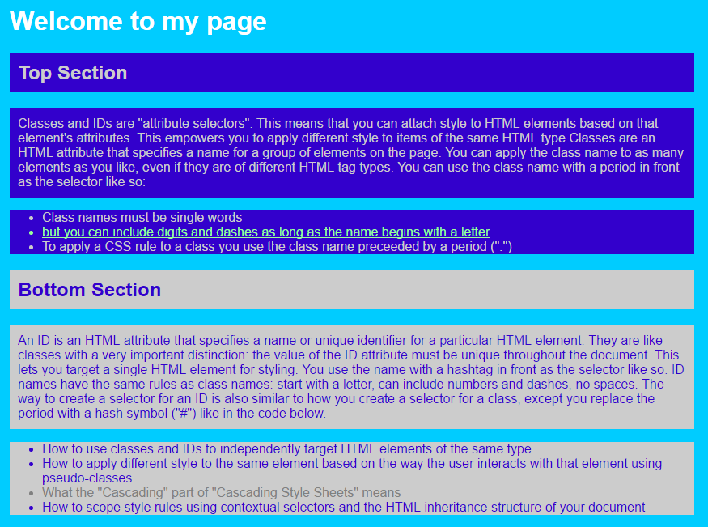

# Oppgaver uke 41

## 1 Class og id
Bruk class og id for å fikse nettsiden slik at den ser ut som på bildet.
Link til kode på codepen: https://codepen.io/techie4good/pen/VKkJYd

```
<!DOCTYPE html>
    <html lang="en">
        <head>
            <meta charset="utf-8">
            <style>
              body {
                background-color: #00ccff;
                color: white;
                font-family: Helvetica, sans-serif;
                margin: 35px 25px 0px 25px;
              }
              p,h2 {
                padding: 10px;
              }
              .topSection{
                background-color: #3300cc;
                color: #cccccc;
              }
              .bottomSection {
                background-color: #cccccc;
                color: #3300cc;
              }
              #importantItem {
                text-decoration: underline;
                color: #99ff99;
              }
              #unimportantItem {
                color: gray;
              }
            </style>
        </head>
  <body>
    <h1>Welcome to my page</h1>
    <h2>Top Section</h2>
    <p>Classes and IDs are "attribute selectors". This means that you can attach style to HTML elements based on that element's attributes. This empowers you to apply different style to items of the same HTML type.Classes are an HTML attribute that specifies a name for a group of elements on the page. You can apply the class name to as many elements as you like, even if they are of different HTML tag types. You can use the class name with a period in front as the selector like so:</p>
    <ul>
      <li>Class names must be single words</li>
      <li>but you can include digits and dashes as long as the name begins with a letter</li>
      <li>To apply a CSS rule to a class you use the class name preceeded by a period (".")</li>
    </ul>
    <h2>Bottom Section</h2>
    <p>An ID is an HTML attribute that specifies a name or unique identifier for a particular HTML element. They are like classes with a very important distinction: the value of the ID attribute must be unique throughout the document. This lets you target a single HTML element for styling. You use the name with a hashtag in front as the selector like so. ID names have the same rules as class names: start with a letter, can include numbers and dashes, no spaces. The way to create a selector for an ID is also similar to how you create a selector for a class, except you replace the period with a hash symbol ("#") like in the code below.
    </p>
    <ul>
      <li>How to use classes and IDs to independently target HTML elements of the same type</li>
      <li>How to apply different style to the same element based on the way the user interacts with that element using pseudo-classes</li>
      <li>What the "Cascading" part of "Cascading Style Sheets" means</li>
      <li>How to scope style rules using contextual selectors and the HTML inheritance structure of your document</li>
    </ul>
  </body>
</html>


```

Koden kan kopieres over i Atom eller redigeres rett i codepen.


